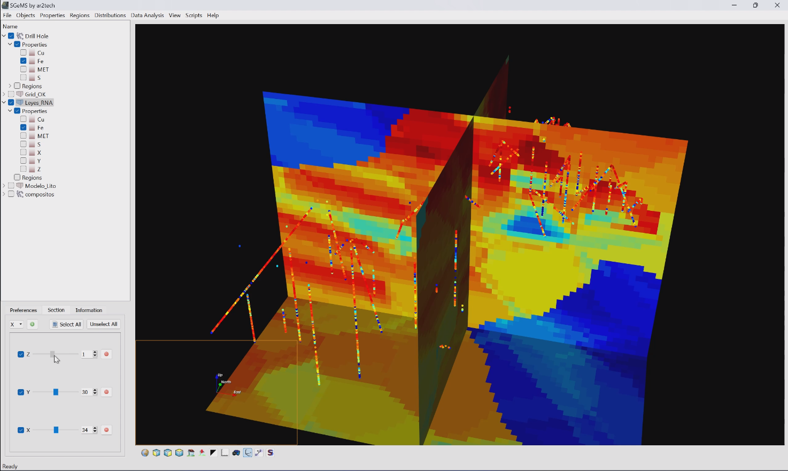

# Desarrollo de un modelo de predicción de leyes de mineral en depósitos de hierro, integrando RNA y sondajes.
Este trabajo tiene como objetivo desarrollar un modelo de predicción de leyes de mineral en depósitos de hierro utilizando técnicas
de redes neuronales artificiales (RNA) y datos de sondajes de perforación. El análisis exploratorio de datos será utilizado para identificar
qué minerales secundarios deben ser considerados para mejorar la precisión del modelo. Se utilizará la integración de datos de sondajes y RNA
para predecir las leyes de mineral en el depósito de hierro. El modelo se validará mediante el uso de datos de perforación no utilizados en el 
desarrollo del modelo. Los resultados podrían proporcionar información valiosa para la planificación y explotación de depósitos de hierro, así
como para la gestión de la calidad del mineral en tiempo real.

